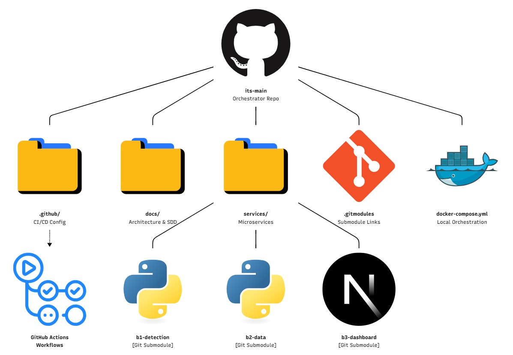
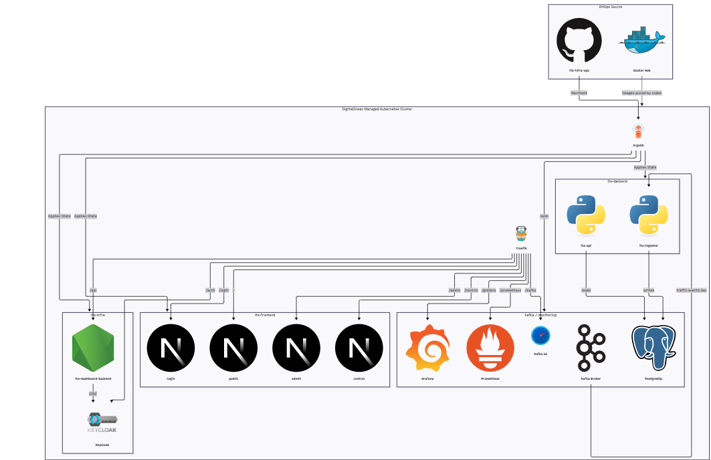
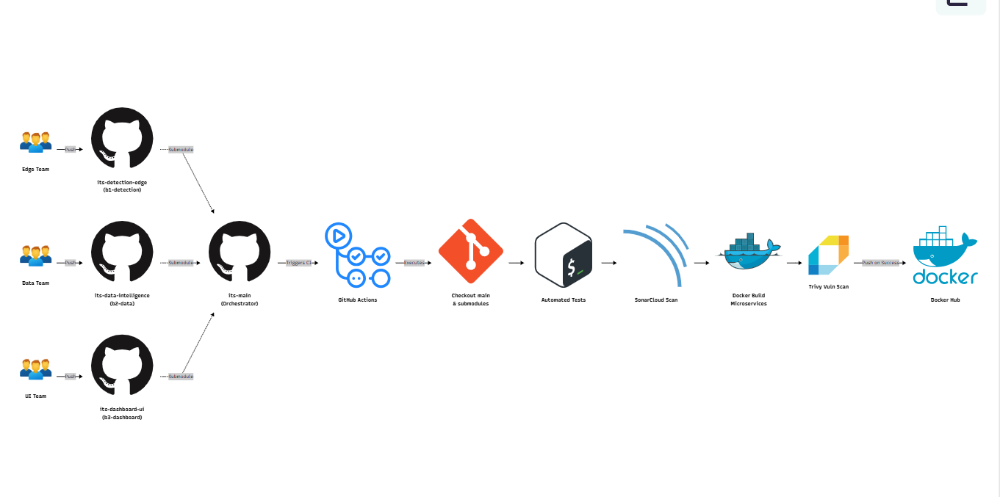
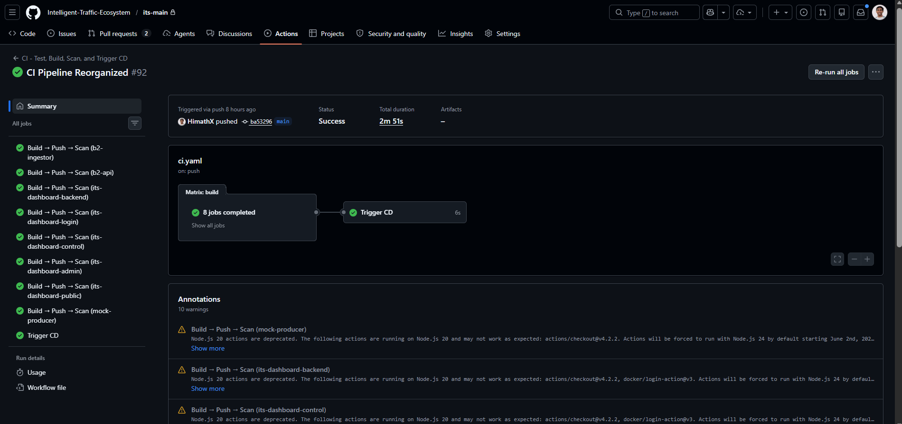
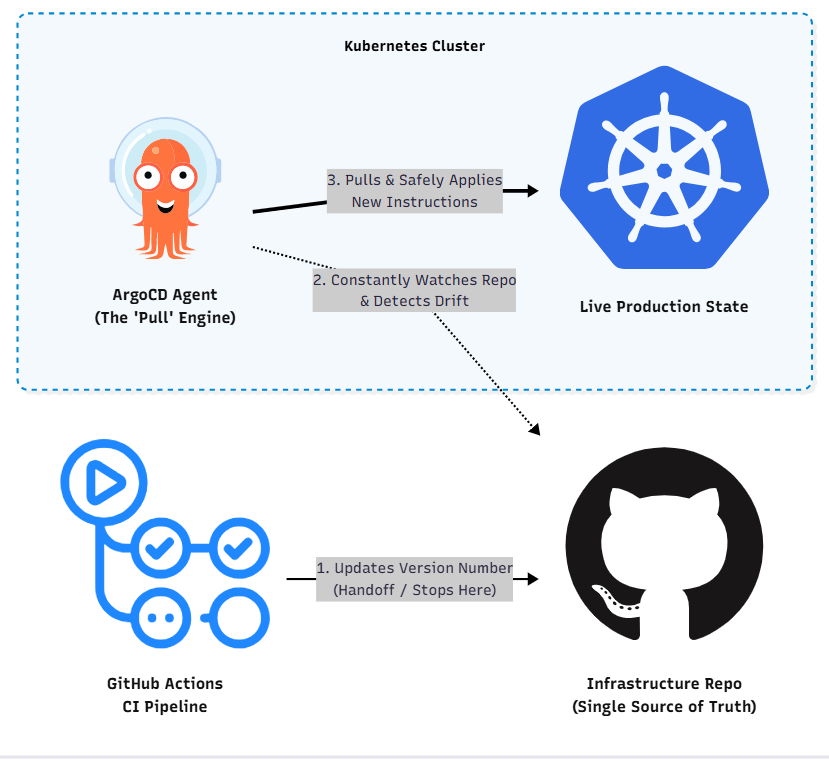
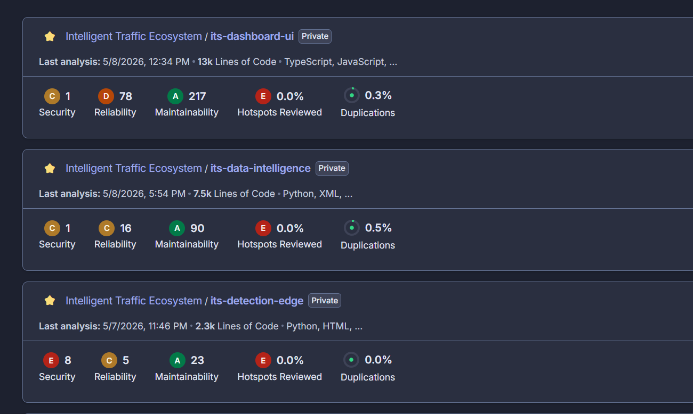

# Intelligent Traffic System (ITS)

AI-powered traffic monitoring platform that replaces manual police radio coordination with camera-based, real-time congestion detection and visualization. Built by four independent engineering teams working across edge, data, dashboard, and platform layers.

[](https://sonarcloud.io/summary/new_code?id=Intelligent-Traffic-Ecosystem_its-main)

---

## What This System Does

| Problem | Solution |
|---|---|
| Police coordinate congestion by radio — slow and inconsistent | Live camera-based detection feeds a shared platform all officers can see |
| Google Maps infers congestion from phone signals — inaccurate | YOLOv8n detects and counts actual vehicles per lane in real time |
| Drivers have no accurate pre-trip information | Public dashboard shows live congestion with no login required |
| Traffic Control Office has no live monitoring tool | Operator dashboard with live KPIs, alerts, and zone monitoring |

---

## Repository Structure

This is the **orchestrator repo**. Each sub-group's service lives in its own repository, linked here as a Git submodule.



```
its-main/
├── .github/workflows/    # CI (ci.yaml) and CD (cd.yaml) pipelines
├── services/
│   ├── b1-detection/     # Edge detection (submodule → its-detection-edge)
│   ├── b2-data/          # Stream processing & API (submodule → its-data-intelligence)
│   └── b3-dashboard/     # Dashboards & BFF (submodule → its-dashboard-ui)
├── docs/                 # Architecture docs, SRS, assets
└── docker-compose.yml    # Local full-stack orchestration
```

---

## Sub-Groups

| Group | Repo | Responsibility |
|---|---|---|
| B1 | [its-detection-edge](https://github.com/Intelligent-Traffic-Ecosystem/its-detection-edge) | Raspberry Pi edge — YOLOv8n detection, ByteTrack, Kafka publishing |
| B2 | [its-data-intelligence](https://github.com/Intelligent-Traffic-Ecosystem/its-data-intelligence) | Flink stream processing, ST-GCN forecast, FastAPI REST + WebSocket |
| B3 | [its-dashboard-ui](https://github.com/Intelligent-Traffic-Ecosystem/its-dashboard-ui) | Next.js dashboards (operator, admin, public), BFF, Keycloak auth |
| B4 | [its-infrastructure-ops](https://github.com/Intelligent-Traffic-Ecosystem/its-infrastructure-ops) | Kubernetes, ArgoCD GitOps, Kafka, Keycloak, Prometheus/Grafana |

---

## System Architecture

Data flows from the edge through Kafka to the stream processor, into PostgreSQL and the API, then out to the dashboards via WebSocket — all in under 500ms end-to-end.

```
Raspberry Pi (B1)
  └── YOLOv8n + ByteTrack
      └── Kafka: traffic.events.raw
              └── Flink 5s windows (B2)
                      └── PostgreSQL + FastAPI
                              └── Socket.IO → Dashboards (B3)
```

Full cluster view including all services, namespaces, and routing:



---

## CI/CD Pipeline

Every push to `main` triggers the full pipeline automatically — no manual deployments.

### CI Flow

Each team pushes to their own sub-repo. Changes to submodule references in `its-main` trigger the CI pipeline, which builds, tests, scans, and pushes all service images.



**CI pipeline steps** (runs in parallel per service via matrix build):

1. Checkout `its-main` with all submodules
2. Run automated tests + SonarCloud analysis (B2)
3. Build Docker image per service
4. Scan image with Trivy (CRITICAL/HIGH vulnerabilities)
5. Push to Docker Hub on success
6. Trigger CD workflow

**Services built in CI:**

| Service | Image |
|---|---|
| B2 Stream Processor | `its-ingestor` |
| B2 API | `its-api` |
| B3 BFF | `its-dashboard-backend` |
| B3 Login | `its-dashboard-login` |
| B3 Traffic Dashboard | `its-dashboard-control` |
| B3 Admin Dashboard | `its-dashboard-admin` |
| B3 Public App | `its-dashboard-public` |
| B1 Mock Producer | `its-mock-producer` |



### CD Flow

The CD pipeline updates the image tag in [its-infrastructure-ops](https://github.com/Intelligent-Traffic-Ecosystem/its-infrastructure-ops). ArgoCD detects the change and rolls out the new version to the cluster automatically.



---

## Code Quality

All services are analysed by SonarCloud on every push. Results cover security, reliability, maintainability, and duplication.



| Repo | Lines of Code | Language |
|---|---|---|
| its-dashboard-ui (B3) | 13k | TypeScript / JavaScript |
| its-data-intelligence (B2) | 7.5k | Python |
| its-detection-edge (B1) | 2.3k | Python |

---

## Getting Started

### Clone with submodules

```bash
git clone --recurse-submodules https://github.com/Intelligent-Traffic-Ecosystem/its-main.git
cd its-main
```

If you already cloned without submodules:

```bash
git submodule update --init --recursive
```

### Run the full system locally

```bash
# Copy and configure environment variables
cp .env.example .env

# Start shared infrastructure (Kafka + PostgreSQL)
docker compose up kafka postgres -d

# Start all services
docker compose up -d

# Check status
docker compose ps
```

### Update a submodule to latest

```bash
# Update all submodules
git submodule update --remote --merge
git add services/
git commit -m "chore: update submodules to latest"
git push

# Update a single submodule (e.g. B2 only)
cd services/b2-data
git pull origin main
cd ../..
git add services/b2-data
git commit -m "chore: update B2 submodule to latest"
git push
```

---

## Environment Variables

See `.env.example` for the full list. Key variables:

| Variable | Used By | Description |
|---|---|---|
| `KAFKA_BROKERS` | B1, B2 | Kafka broker address |
| `DATABASE_URL` | B2 | PostgreSQL connection string |
| `KEYCLOAK_URL` | B3 BFF | Keycloak base URL |
| `CLIENT_SECRET` | B3 BFF | OAuth2 client secret (never commit this) |
| `NEXT_PUBLIC_GOOGLE_MAPS_API_KEY` | B3 Dashboard | Maps API key |

---

## Documentation

| Document | Description |
|---|---|
| [System Architecture](docs/architecture.md) | Data flow, service map, integration points |
| [SRS](docs/SRS.pdf) | Full Software Requirements Specification (IEEE 830-1998) |
